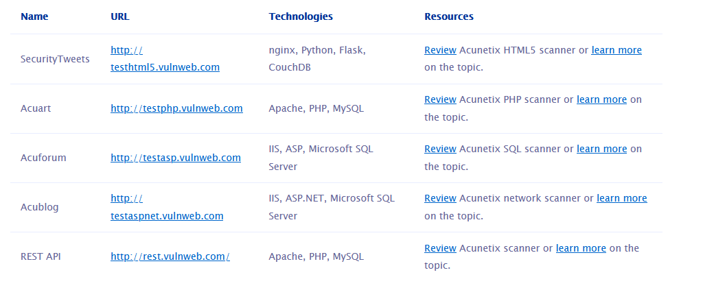

# Avaliação Final CS | Relatório do site Vulnweb.com

## Escopo
Gerar um relatório de invasão dos sites indexados no [vulnweb.com](http://vulnweb.com/) | Teste black-box porém o site oferece conhecimento dos aplicativos rodando em cada endpoint.

### Sites:

- [testhtml5](http://testhtml5.vulnweb.com)
- [testphp](http://testphp.vulnweb.com)
- [testasp](http://testasp.vulnweb.com)
- [testaspnet](http://testaspnet.vulnweb.com/)
- [rest](http://rest.vulnweb.com)

### Fases:

- Recon(footprinting + varredura): Coleta de informações sobre o alvo.
- Enumeração: Identificação de serviços em portas abertas, SO que está sendo utilizado.
- Exploit: Explorar falhas encontradas no sistema.
- Relatório: Elaboração deste documento, explicando cada etapa, comandos, tecnologias e resultados com prints.

## Visão geral dos Sites
Os sites, por serem de uma empresa focada em soluções de segurança para empresas, fornece exatamente qual tipo de vulnerabilidade e quais são as tecnologias utilizadas em cada endpoint. 

Na aba *Technologies* temos a stack utilizada e na aba *Resources* podemos encontrar um artigo, da própria empresa, sobre como mitigar ou informações sobre um possível exploit daquele endpoint específico. 
 
## Metodologia

### Recon
Na fase de reconhecimento foram utilizados os dados do próprio site(vulnweb.com), Google dorks (operações avançadas de busca) exemplo - site:testphp.vulnweb.com +"Index of /admin", pesquisa pelos sites builtwith.com, whois.com e ferramentas de enumeração/exploit automatizadas como: dirb, sqlmap e nmap.

### Enumeração
Para identificação dos serviços, IPs, portas abertas e SOs utilizados foi utilizado o **NMap**, na descrição dos sites temos quais aplicativos estão rodando mas, ainda assim, achei interessante usar essa ferramenta e tirar o máximo dessa atividade prática.

Para enumeração/listagem dos bancos de dados, SGBDs e tabelas, foi utilizado o **SQLMap**.

Para listagem de diretórios nos websites foi utilizado o **DIRB**.

### Exploit
A ferramenta que se mostrou muito importante para essa fase foi o **SQLMap**. Uma vez que o foco dessa avaliação era o SQLInjection.

Para os outros sites eu testei algumas ferramentas como **XSSer**, **BEEF** e **XSRFProbe**.

A vulnerabilidade de Cross Site Scripting foi exemplificada com dois prints presentes no diretório a seguir: [diretório](./assets/screenshots/xss/)

## Conclusão

<!--
A fase de exploit foi onde pude perceber como as vulnerabilidades e erros de código, que são simples de se evitar, podem acabar com a confiabilidade de uma empresa ou prejudicar diversas entidades ao mesmo tempo.

Embora as outras ferramentas não me geraram muitos resultados, por falta de conhecimento, estou estudando ativamente para entender mais sobre essas vulnerabilidades e como utilizar as ferramentas adequadamente. O BEEF é uma ferramenta muito robusta e é possível até rastrear pacotes enviados e recebidos pelo browser.
-->

## Referências
- [Livro: Segredos do Hacker Ético 4ª Edição](https://www.amazon.com.br/Segredos-Hacker-Marcos-Fl%C3%A1vio-Assun%C3%A7%C3%A3o/dp/8575022857#customerReviews)
- [OWASP SQLInjection Cheat_Sheet](https://cheatsheetseries.owasp.org/cheatsheets/SQL_Injection_Prevention_Cheat_Sheet.html)