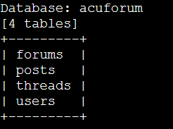

# Relatório testaspnet

## Arquitetura do Sistema
IPs: 44.238.29.244
rDNS: ec2-44-238-29-244.us-west-2.compute.amazonaws.com
Servidor Web: Microsoft IIS httpd 8.5
Hosting: VPC Amazon EC2

## Enumeração
Para descobrirmos os bancos de dados existentes rodamos o seguinte comando, onde **-u** é a flag para especificar a url a ser testada e **--dbs** é a flag para procurar os bancos de dados disponíveis:
(campos envoltos de chaves **{}** são campos que você terá que digitar manualmente, -u será a url ex: http://localhost:8080/getuserbyid?=0)
```bash
sqlmap -u {URL} --dbs
```


Rodando o comando com duas flags novas, **-D {banco_de_dados}** e **--tables**, podemos encontrar as tabelas que estão presentes no banco de dados especificado.
```bash
sqlmap -u {URL} -D {banco} --tables
```


## Potenciais Ameaças
Além de estar sucesstível a SQLInjection, XSS e outras vulnerabilidades. Um erro maior é guardar as credenciais do usuário sem o uso de criptografia.


## Resultados
Utilizando as credenciais do usuário _admin_ foi possível criar uma postagem no forum.

